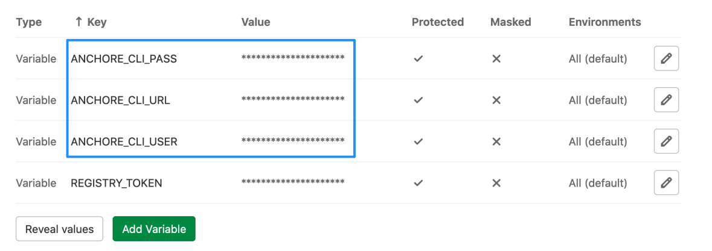
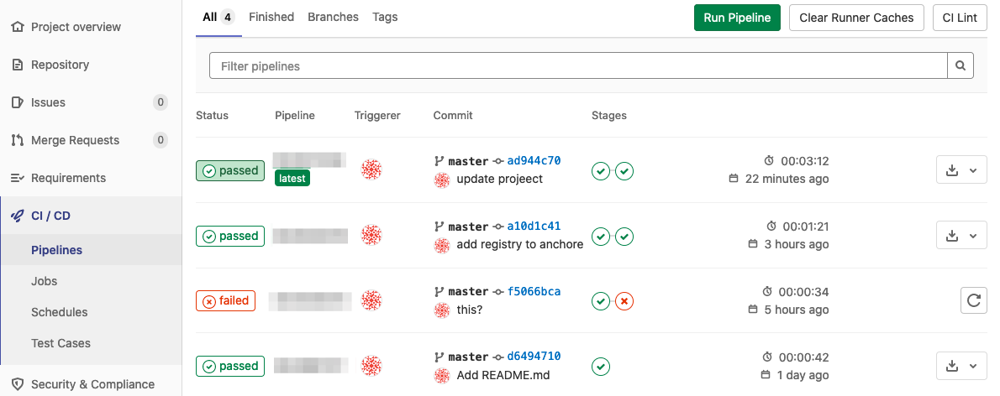
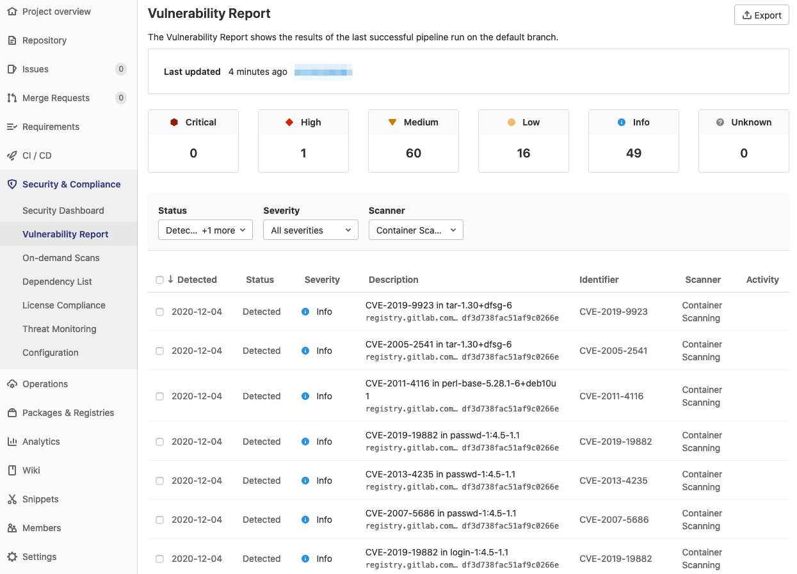

### Adding Anchore Scanning to Gitlab

The Anchore Enterprise GitLab Scan integration enables vulnerability scanning via Anchore Enterprise in GitLab CI. This includes automatic conversion Anchore's default vulnerability report format to GitLab's container scanning format, for display in GitLab's Security & Compliance Vulnerability UI.


### Requirements

1. Anchore Enterprise is deployed in your environment, with the API accessible from your GitLab CI environment.
1. Credentials for your GitLab Container Registry are added to Anchore Enterprise, under the Anchore account that you intend to use with GitLab CI. See https://docs.anchore.com/current/docs/using/ui_usage/registries/.  For information on what registry/credentials must be added to allow Anchore Enterprise to access your GitLab Container Registry, see https://docs.gitlab.com/ee/user/packages/container_registry/.

### Usage

1. In your GitLab project repository, ensure that the following variables are set in Settings > CI/CD > Variables:
- ANCHORE_CLI_URL
- ANCHORE_CLI_USER
- ANCHORE_CLI_PASS

This allows the integration to access your Anchore Enterprise depoyment.  The ANCHORE_CLI_PASS variable should have protected and masked options set to prevent exposure of the variable in job logs.

2. In your project's .gitlab-ci.yml, include the following snippet anywhere in your CI flow after your target container image has been built and pushed to the GitLab Container Registry that you have made accessible from your Anchore Enterprise deployment.

```
containerscan:anchorescan:
  stage: test
  image: docker.io/anchore/enterprise-gitlab-scan:v1
  variables:
    ANCHORE_IMAGE: "${CI_REGISTRY_IMAGE}:${CI_COMMIT_SHA}"
  script:
    - anchore-cli --u "${ANCHORE_CLI_USER}" --p "${ANCHORE_CLI_PASS}" --url "${ANCHORE_CLI_URL}" registry add "${CI_REGISTRY}" "${CI_REGISTRY_USER}" "${REGISTRY_TOKEN}"
    - anchore-gitlab-scan > gl-container-scanning-report.json
  artifacts:
    reports:
      container_scanning: gl-container-scanning-report.json
```

3. After a successful scan, results will now be available for review and management using GitLab's native security features. Navigate to your project's Security & Compiance > Vulnerability Report UI to review any discovered vulnerabilities in your container image.

### Example

For this example, we'll add two sections to GitLab CI's .gitlab-ci.yml; the first runs Docker to build an image and then pushes it to the GitLab Container Registry for the project. The second runs Anchore Enterprise vulnerability scanning on the image and converts the output to GitLab's container scanning format.

#### Add Dockerfile and .gitlab-ci.yml To Your GitLab Project

Example Dockerfile:
```
FROM alpine:latest

CMD /bin/sh
```

Example .gitlab-ci.yml:

```
# Build our image and push it to our project's container repo
containerbuild:
  stage: build
  image: docker:19.03.12
  variables:
    DOCKER_TLS_CERTDIR: "/certs"
  services:
    - docker:19.03.12-dind
  # See note below on Access Tokens for authenticating to the GitLab Container Registry
  before_script:
    - docker login -u $CI_REGISTRY_USER -p $CI_REGISTRY_PASSWORD $CI_REGISTRY
  script:
    - docker pull $CI_REGISTRY_IMAGE:latest || true
    - docker build --cache-from $CI_REGISTRY_IMAGE:latest --tag $CI_REGISTRY_IMAGE:$CI_COMMIT_SHA --tag $CI_REGISTRY_IMAGE:latest .
    - docker push $CI_REGISTRY_IMAGE:$CI_COMMIT_SHA
    - docker push $CI_REGISTRY_IMAGE:latest

# Scan with Anchore Enterprise and convert the results for GitLab's native security display
containerscan:anchorescan:
  stage: test
  image: docker.io/anchore/enterprise-gitlab-scan:v1
  variables:
    ANCHORE_IMAGE: "${CI_REGISTRY_IMAGE}:${CI_COMMIT_SHA}"
  script:
    - anchore-gitlab-scan > gl-container-scanning-report.json
  artifacts:
    reports:
      container_scanning: gl-container-scanning-report.json
```

#### Navigate To Settings > CI/CD; Expand the Variables Section


#### Set Or Edit Anchore Variables



#### Trigger GitLab CI

Make a change in the repository that will trigger GitLab CI so that your pipeline runs.

Then, navigate to CI/CD > Pipelines, where you can see details of your pipelines:



#### Review Scan Report

Navigate to Security & Compliance > Vulnerability Report to view the scan results:



### Access Tokens

Authentication with the GitLab Container Registry can use a personal access token or a deploy token.  Please see [GitLab's documentation](https://docs.gitlab.com/ee/user/packages/container_registry/index.html#authenticate-with-the-container-registry) on authentication options.


